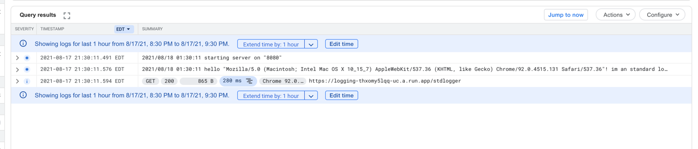
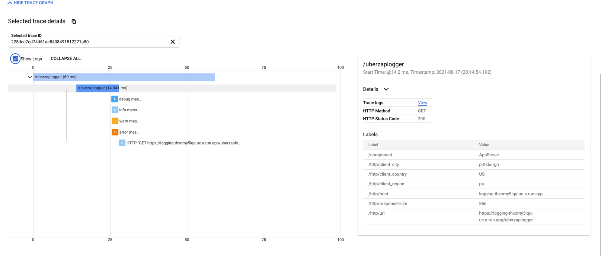
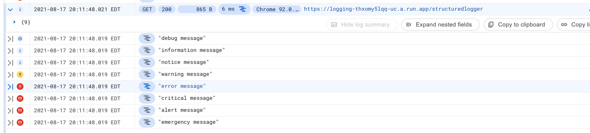

# Structured Logging

Structured logging is a way to level up your insights into your application that is running on cloud run. Within this
example we will go over 3 different styles of logging and the incremental benefits you would get for each one.

## Standard library logging

Our basic logging approach is as simple as it gets, we will use the golang std library logger under the log package. If
you are new to go, this is most likely what you have been using so far. It is as simple as

```go
package main

import (
	"log"
)

func main() {
	log.Printf("hello %q", "alex")
}
```

When you use this logger, the output will be directed to STDERR and cloud run will pick up the log statement and add a
tiny bit of information around it, here is an example of what is produced by gcp logging when we would log
this `log.Printf("hello %q! im an standard logger from the golang standard library", request.UserAgent())`

```json5
{
  // text payload is our actual log message
  "textPayload": "2021/08/18 01:30:11 hello \"Mozilla/5.0 (Macintosh; Intel Mac OS X 10_15_7) AppleWebKit/537.36 (KHTML, like Gecko) Chrome/92.0.4515.131 Safari/537.36\"! im an standard logger from the golang standard library",
  // insert id is automatically calculated
  "insertId": "611c62a30008cc0be6f91983",
  // resource is automatically inferred due to the log entry being written to STDERR
  "resource": {
    "type": "cloud_run_revision",
    "labels": {
      "service_name": "logging",
      "project_id": "mammay-labs",
      "revision_name": "logging-00003-wil",
      "location": "us-central1",
      "configuration_name": "logging"
    }
  },
  // timestamp is auto calculated
  "timestamp": "2021-08-18T01:30:11.576523Z",
  // instance id label is automatically added
  "labels": {
    "instanceId": "00bf4bf02dd076018e4f332daec97d8ebce3bb2a4da1d941bc9f30e3773efd19ff329eb7e3778f1461e05af587de3d79095acfe02468a6d875c5552845"
  },
  // gcp will monitor stdout and stderr
  "logName": "projects/mammay-labs/logs/run.googleapis.com%2Fstderr",
  // another timestamp that is auto calculated
  "receiveTimestamp": "2021-08-18T01:30:11.829264005Z"
}
```



So what we have shown for the standard library logger is the most primitive way that you log something on gcp, but you
are running this on gcp! You might as well get the most bang for your buck and beef it up with some structured logging
statements.

## Basic Structured logging

Our basic structured logging implementation is very flexible with regard to how you would want to implement it. If your
team needs a large amount of flexibility/control over a logger that you would be distributing to other teammates this
would be a building block to achieve such a goal.

The gist of what you want to accomplish is to write your logs as json to STDERR. There is a schema you must follow when
writing the entries, and you can view the requirements
here [gcp structured-logging](https://cloud.google.com/logging/docs/structured-logging)

The most basic way you can implement something that would adhere to the structured logging schema would be like...

```go
package logx

import (
	"fmt"
	"net/http"
)

func info(r *http.Request, message interface{}, projectID string) {
	get := r.Header.Get("X-Cloud-Trace-Context")
	traceID, spanID, traceSampled := deconstructXCloudTraceContext(get)
	traceID = fmt.Sprintf("projects/%s/traces/%s", projectID, traceID)
	entry := logEntry{
		Severity: "INFO",
		Message:  message,
		HttpRequest: &httpRequest{
			RequestMethod: r.Method,
			RequestUrl:    r.URL.String(),
			UserAgent:     r.UserAgent(),
			RemoteIp:      r.RemoteAddr,
			Referer:       r.Referer(),
		},
		Timestamp:    time.Now(),
		Labels:       map[string]string{"labels": "rock"},
		SpanID:       spanID,
		TraceID:      traceID,
		TraceSampled: traceSampled,
	}
	writelog(&entry)
}

func writelog(entry *logEntry) {
	if err := json.NewEncoder(os.Stderr).Encode(entry); err != nil {
		fmt.Printf("failure to write structured log entry: %v", err)
	}
}

// taken from https://github.com/googleapis/google-cloud-go/blob/master/logging/logging.go#L774
var reCloudTraceContext = regexp.MustCompile(
	// Matches on "TRACE_ID"
	`([a-f\d]+)?` +
		// Matches on "/SPAN_ID"
		`(?:/([a-f\d]+))?` +
		// Matches on ";0=TRACE_TRUE"
		`(?:;o=(\d))?`)

func deconstructXCloudTraceContext(s string) (traceID, spanID string, traceSampled bool) {
	// As per the format described at https://cloud.google.com/trace/docs/setup#force-trace
	//    "X-Cloud-Trace-Context: TRACE_ID/SPAN_ID;o=TRACE_TRUE"
	// for example:
	//    "X-Cloud-Trace-Context: 105445aa7843bc8bf206b120001000/1;o=1"
	//
	// We expect:
	//   * traceID (optional): 			"105445aa7843bc8bf206b120001000"
	//   * spanID (optional):       	"1"
	//   * traceSampled (optional): 	true
	matches := reCloudTraceContext.FindStringSubmatch(s)

	traceID, spanID, traceSampled = matches[1], matches[2], matches[3] == "1"

	if spanID == "0" {
		spanID = ""
	}

	return
}

```

This accomplishes a number of things. First lets look at what the output looks like in gcp logging

1. Severity mapping, can be easily used for cloud monitoring to send notifications based on reported severity from log
   statements.
2. Decorate log message with http request data for advanced logging queries.
3. Provide structured json as a log message that can be as complex as needed. This also provides opportunity for
   advanced logging queries.
4. Trace ID + Span ID support, this will allow us to correlate log entries to cloud trace for better insight to
   fine-grained application behavior.
   

```json5
{
  // auto generated insert ID
  "insertId": "611c679300037f00b8a3abce",
  // our log message gets wrapped in json payload if you send in a json friendly message
  "jsonPayload": {
    "timestamp": "2021-08-18T01:51:15.228952576Z",
    "message": "information message"
  },
  // fill in the http request to give extra context around what our application is handling
  "httpRequest": {
    "requestMethod": "GET",
    "requestUrl": "/structuredlogger",
    "userAgent": "Mozilla/5.0 (Macintosh; Intel Mac OS X 10_15_7) AppleWebKit/537.36 (KHTML, like Gecko) Chrome/92.0.4515.131 Safari/537.36",
    "remoteIp": "169.254.8.129:32316"
  },
  // auto generated due to the nature that we are writing to STDERR
  "resource": {
    "type": "cloud_run_revision",
    "labels": {
      "project_id": "mammay-labs",
      "configuration_name": "logging",
      "revision_name": "logging-00003-wil",
      "location": "us-central1",
      "service_name": "logging"
    }
  },
  "timestamp": "2021-08-18T01:51:15.229120Z",
  // pure info severity message, can be anything from https://cloud.google.com/logging/docs/reference/v2/rest/v2/LogEntry#LogSeverity
  "severity": "INFO",
  "labels": {
    // custom label we added
    "labels": "rock",
    "instanceId": "00bf4bf02d728741a6c4e41e7cabe309fe6857d005b0a31df24a74786e7f909f47e95c96545a213ea7789f7016f8e2ff0b47fc2732718fe030372f2792"
  },
  "logName": "projects/mammay-labs/logs/run.googleapis.com%2Fstderr",
  // add cloud trace id 
  "trace": "projects/mammay-labs/traces/c83f888de20ad443abe581370e2a3beb",
  "receiveTimestamp": "2021-08-18T01:51:15.474376268Z",
  // add our span id 
  "spanId": "3688206018754987042",
  // notify gcp that we should sample this trace and aggregate data into cloud trace
  "traceSampled": true
}
```

Now within GCP here is an example of what log entries with various severities looks like.

